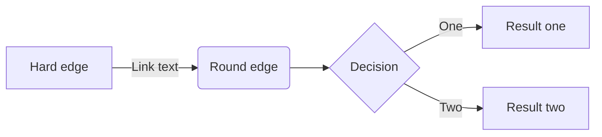

# P6-good-description-for-graphs
Research into a framework/language for describing RDF endpoints to enable effective query federation.

## Setup locally
This project is written in LaTeX. To prepare your local machine for this project, follow this guide.

Overview

1. Install Visual Studio Code (VSCode) in Windows ([Visual Studio Code](https://code.visualstudio.com "Visual Studio Code website"))
   - Install the Remote Development extension in VSCode.
2. Install Windows Terminal ([Microsoft Store](https://www.microsoft.com/store/productId/9N0DX20HK701 "Windows Terminal in MS Store")).
   - Consider installing Oh My Posh ([guide](https://learn.microsoft.com/en-us/windows/terminal/tutorials/custom-prompt-setup "Oh My Posh tutorial")).
3. Install WSL with latest Ubuntu distribution ([guide](https://learn.microsoft.com/en-us/windows/wsl/install "Install Linux on Windows with WSL")).
4. Install WSLU ([guide](https://wslutiliti.es/wslu/install.html "wslu wiki")).
5. Install GitHub CLI ([guide](https://github.com/cli/cli/blob/trunk/docs/install_linux.md "Installing gh on Linux and BSD")).
   - Authorize and setup the gh CLI too.
6. Run the setup scripts for P6 and VSCode ([scripts](https://github.com/AAU-Dat/scripts "WSL setup scripts")).
7. Clone the repo to your WSL and get to work :smile:

# WIP from below
### Detailed setup

```bash
```

>**Note**
> test


