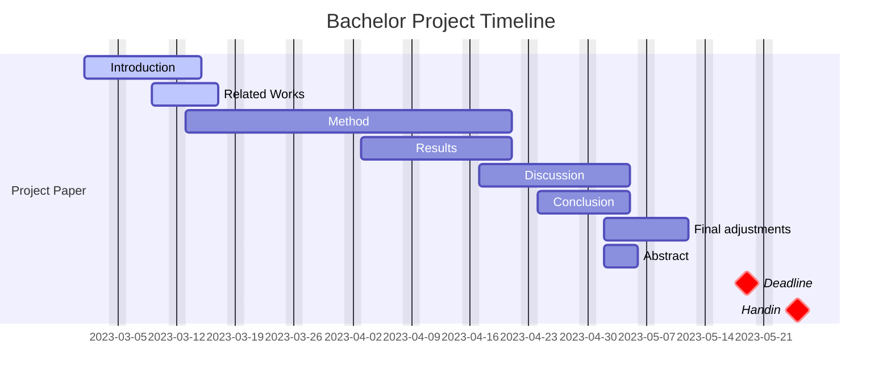
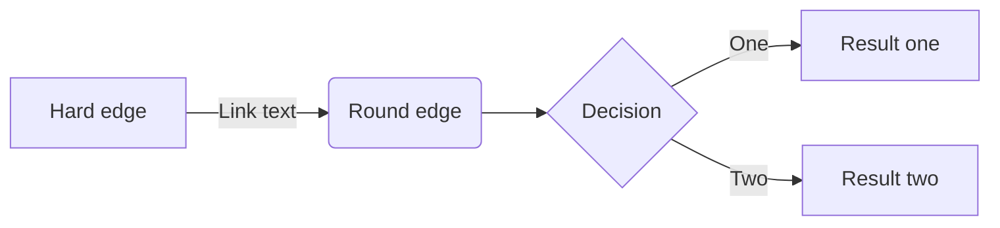

# P6-good-description-for-graphs
Research into a framework/language for describing RDF endpoints to enable effective query federation.

## Setup locally
This project is written in LaTeX. To prepare your local machine for this project, follow this guide.

Overview

1. Install Visual Studio Code (VSCode) in Windows ([Visual Studio Code](https://code.visualstudio.com "Visual Studio Code website"))
   - Install the Remote Development extension in VSCode.
2. Install Windows Terminal ([Microsoft Store](https://www.microsoft.com/store/productId/9N0DX20HK701 "Windows Terminal in MS Store")).
   - Consider installing Oh My Posh ([guide](https://learn.microsoft.com/en-us/windows/terminal/tutorials/custom-prompt-setup "Oh My Posh tutorial")).
3. Install WSL with latest Ubuntu distribution ([guide](https://learn.microsoft.com/en-us/windows/wsl/install "Install Linux on Windows with WSL")).
4. Install WSLU ([guide](https://wslutiliti.es/wslu/install.html "wslu wiki")).
5. Install GitHub CLI ([guide](https://github.com/cli/cli/blob/trunk/docs/install_linux.md "Installing gh on Linux and BSD")).
   - Authorize and setup the gh CLI too.
6. Run the setup scripts for P6 and VSCode ([scripts](https://github.com/AAU-Dat/scripts "WSL setup scripts")).
7. Clone the repo to your WSL and get to work :smile:

# Project Plan


# WIP from below
### Detailed setup

```bash
```


>**Note**
> test




# Download and setup Docker for the database
---
1. Download Docker from this cite: https://www.docker.com/, Select the Windows installer.
2. Open Docker, when it is finished download.
	1. You will have restart your computer after the download is finished.
3. Turn your computer back on and open Docker.
	1. Accept the agreement from Docker.
	2. Select the use for Docker (Student, Learning and teaching).
	3. We will skip the tutorial, if you want to you can do the tutorial.
- Docker is now downloaded and ready for use.

### GraphDB Download into Docker
---
1. Open Docker and your Ubuntu terminal.
2. Run this line on your ubuntu terminal.

		docker run -p 127.0.0.1:7200:7200 --name pokemon-DB -t ontotext/graphdb:10.2.0
		
      It will say "Unable to find image ... locally", this just means it downloads graphdb from the internet.
3. Go to Docker again
	1. You should now a container named "pokemondb" on Docker.
	2.  It should be running on your computer already.
	3.  Open the pokemon database by clicking at the ports used for the database at "7200:7200".
	- Your computer should now open a window on a localhost for GraphDB.

### Import the data into graphDB
---
1. Open the localhost for the database in graphDB.
2. Look at the left side of the window, where a menu should be.
3. Goto Setup, which will show a drop-down menu, where we will select "Repositories".
4. Create a new repository by clicking the button.
	1. Select graphDB repository.
	2. Name the repository "pokedb".
	3. Nothing else needs to be changed, and create the repository.
5. The new repository created can now be seen on repositories menu.
6.  Click on the two seperated cables on the left.
7.  The repository should now be active.
8. It is now time to download the data for the database.
9. Go into the ubuntu terminal, and go into the repository and into the folder named "database".
10. In the folder download the file named"poke-test-db.ttl".
11. Now open up the local graphDB host again.
12.  Goto the left side and click on Import.
13. Upload RDF files.
14. Select the "poke-test-db.ttl" file.
15.  Click on import, no changes required.
-  You have now, setup Docker with GraphDB with our repository and data, you have to import the data every time you run the database. 