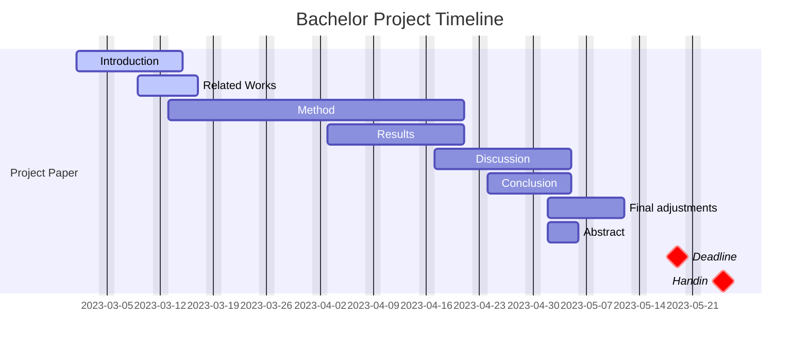

# P6-good-description-for-graphs
Research into a framework/language for describing RDF endpoints to enable effective query federation.

## Project Plan


## Setup locally
This project is written in LaTeX. To prepare your local machine for this project, follow this guide.

1. Install Visual Studio Code (VSCode) in Windows ([Visual Studio Code](https://code.visualstudio.com "Visual Studio Code website")).
   - Install the Remote Development extension in VSCode.
2. Install Windows Terminal ([Microsoft Store](https://www.microsoft.com/store/productId/9N0DX20HK701 "Windows Terminal in MS Store")).
   - Consider installing Oh My Posh ([guide](https://learn.microsoft.com/en-us/windows/terminal/tutorials/custom-prompt-setup "Oh My Posh tutorial")).
3. Install WSL with latest Ubuntu distribution ([guide](https://learn.microsoft.com/en-us/windows/wsl/install "Install Linux on Windows with WSL")).
4. Install WSLU ([guide](https://wslutiliti.es/wslu/install.html "wslu wiki")).
5. Install GitHub CLI ([guide](https://github.com/cli/cli/blob/trunk/docs/install_linux.md "Installing gh on Linux and BSD")).
   - Authorize and setup the gh CLI too.
6. Run the setup scripts for P6 and VSCode ([scripts](https://github.com/AAU-Dat/scripts "WSL setup scripts")).
7. Clone the repo to your WSL and get to work :smile:

## Setup Database with Docker
This project uses GraphDB. To work in a GraphDB through Docker, follow this guide.

1. Install Docker Desktop in Windows ([Docker Desktop](https://www.docker.com/ "Docker Website"))
   - This installs Docker in WSL as well.
   - Make sure to select the Student, learning and teaching use.
2. Run `docker compose up --build` from your local project folder in WSL to create your local database.
   - Optionally open Docker Desktop in Windows to manage your containers directly.
3. Go to http://localhost:7200/ to access the GraphDB workbench.

### Reset Database
To reset the database to the default state run the following commands:

```bash
docker compose down -v
docker compose up --build
```

## Download data with git lfs
This project uses git lfs. To work with large files, follow this guide.

1. Install git lfs in your local project folder in WSL with these commands.
    - ´curl -s https://packagecloud.io/install/repositories/github/git-lfs/script.deb.sh | sudo bash´
    - ´sudo apt-get install git-lfs´
To download a data file from dataset write the command `git lfs pull --include "one-million.nt" `
        ´git lfs fetch --all´ for all files
